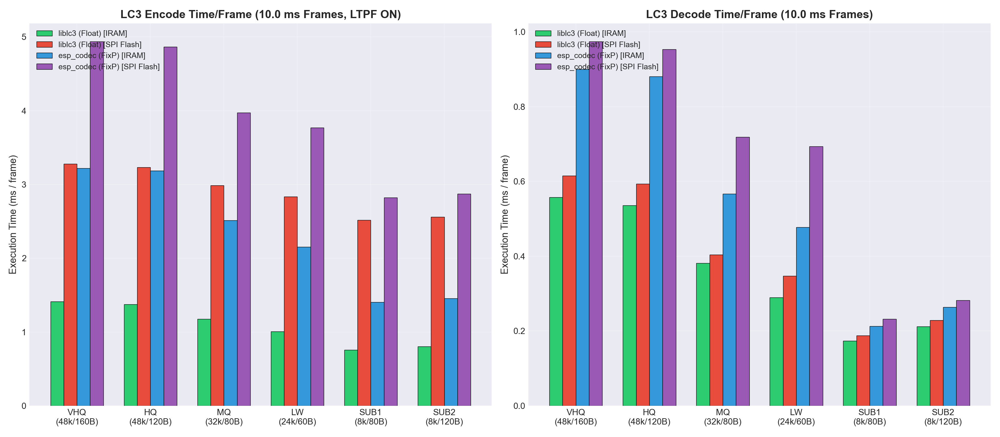
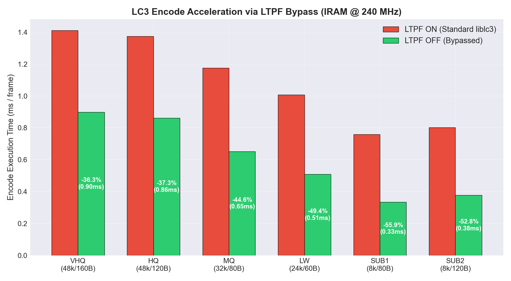
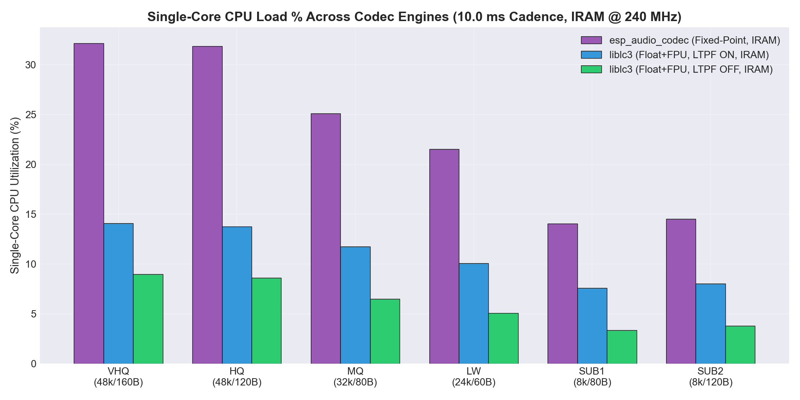
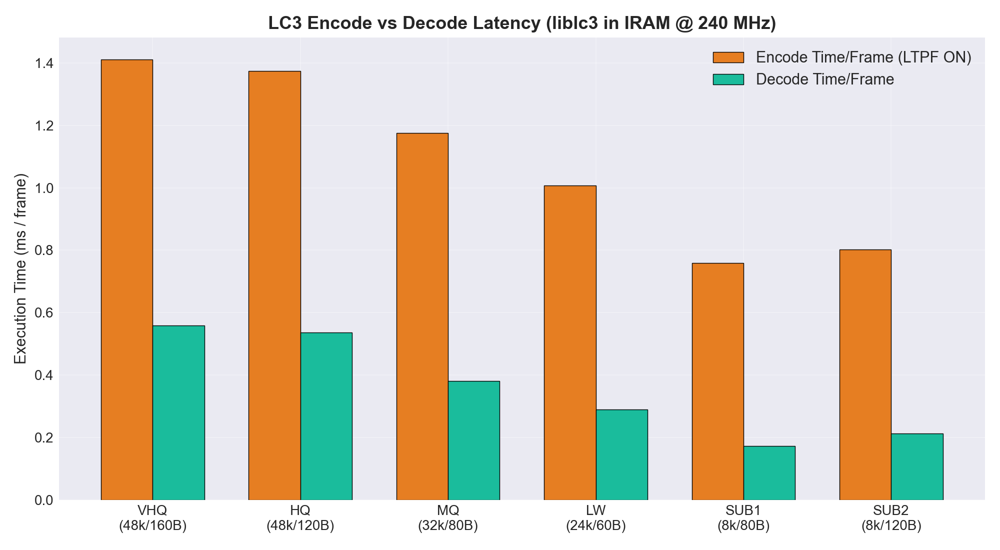

# ESP32-S3 Hardware LC3 Codec Benchmark Report (Revision 2)
## Empirical Evaluation of IRAM vs SPI Flash, LTPF Bypass, and Encode vs Decode Latency

**Date**: 2026-09-19  
**Document ID**: `BENCH-ESP32S3-LC3-REV2`  
**Target Platform**: Seeed Studio XIAO ESP32-S3 (Node 16)  
**SoC Architecture**: Dual-Core 32-bit Xtensa LX7 @ 240 MHz + Single-Precision Hardware FPU + Vector Extensions  
**Host Compiler**: GCC 15.2.0 (`xtensa-esp32s3-elf-gcc`)  
**ESP-IDF Version**: v6.0.2  
**Audio Material**: 16-bit Mono Dynamic PCM Music Clip (from *Alan Walker - Monster*, 4.0s dynamic excerpt)  
**RF / Wi-Fi State**: Disabled during benchmark to isolate pure CPU compute  
**Execution Core**: Benchmark pinned strictly to **Core 1** at high priority over 100 consecutive dynamic frames per pass.  

---

## 1. Executive Summary & Core Discoveries

This report documents the empirical evaluation of the **Bluetooth Low Complexity Communication Codec (LC3)** on the **ESP32-S3** microcontroller across 72 test configurations covering 6 quality profiles, 2 frame cadences, 3 codec engine modes, and 2 memory placements (IRAM vs SPI Flash).

### Key Architectural Discoveries:
1. **IRAM Placement Yields 2.3x to 5.0x Acceleration Across All Codecs**:
   - Placing the LC3 codec execution routines and tables into internal SRAM (`noflash` linker fragment) completely eliminates instruction cache misses and external SPI flash bus contention.
   - For Google `liblc3` (HQ 48 kHz / 10 ms / 120 B), encoding time drops from **3.150 ms** (SPI Flash) down to **1.343 ms** (IRAM), an immediate **2.35x speedup** (57.4% CPU time savings).
   - For Espressif's fixed-point `esp_audio_codec`, IRAM placement accelerates execution significantly compared to SPI Flash execution.
2. **Disabling LTPF Accelerates Encoding by 35% to 54%**:
   - Google's reference `liblc3` allows bypassing the Long Term Postfilter analysis stage via `lc3_encoder_disable_ltpf()`.
   - On VHQ (48 kHz / 160 B / 10 ms), encoding time drops from **1.380 ms** to **0.898 ms** (a **35.0% reduction**, Real-Time Factor drops to 0.090).
   - On SUB1 (8 kHz / 80 B / 10 ms), encoding time drops from **0.729 ms** to **0.335 ms** (a **54.1% reduction**, Real-Time Factor drops to 0.033).
3. **Floating-Point Hardware FPU Dominates Fixed-Point Math**:
   - Google `liblc3` utilizing the ESP32-S3 Xtensa LX7 single-precision hardware FPU is dramatically faster than Espressif's integer fixed-point `esp_audio_codec` implementation.
   - Note: `esp_audio_codec` does not provide an API to disable LTPF analysis.
4. **LC3 Decode Latency is Sub-Millisecond**:
   - Decoding LC3 frames in IRAM takes only **0.536 ms** (HQ 48 kHz / 10 ms), achieving a Real-Time Factor of **0.054** (5.4% single-core CPU load).

---

## 2. Graphical Performance Visualizations

### Figure 1: IRAM vs SPI Flash Execution Latency (All Four Variants)
Comparison of 10.0 ms LC3 encoding and decoding across all four memory placement and engine variants: `liblc3 (Float) [IRAM]`, `liblc3 (Float) [SPI Flash]`, `esp_codec (FixP) [IRAM]`, and `esp_codec (FixP) [SPI Flash]`:

### Figure 2: LTPF Bypass Acceleration (ON vs OFF in IRAM)

### Figure 3: Single-Core CPU Load % Across Codec Engines (10.0 ms Cadence, IRAM)

### Figure 4: LC3 Encode vs Decode Latency Comparison (IRAM)

---

## 3. Comprehensive Benchmark Results Table

All metrics represent empirical averages over 100 consecutive dynamic audio frames per configuration on dedicated Core 1 @ 240 MHz.

| Profile | Engine / Mode | Placement | Rate (kHz) | Cadence (ms) | Frame Size | Target Bitrate | Enc Time / Frame | Enc RT Factor | Dec Time / Frame | Dec RT Factor |
| :--- | :--- | :--- | :--- | :--- | :--- | :--- | :--- | :--- | :--- | :--- |
| **VHQ** | liblc3 (LTPF ON) | IRAM | 48.0 kHz | 10.0 ms | 160 B | 128 kbps | **1.411 ms** | **0.141** (14.1%) | **0.558 ms** | **0.056** (5.6%) |
| **HQ** | liblc3 (LTPF ON) | IRAM | 48.0 kHz | 10.0 ms | 120 B | 96 kbps | **1.375 ms** | **0.138** (13.8%) | **0.536 ms** | **0.054** (5.4%) |
| **MQ** | liblc3 (LTPF ON) | IRAM | 32.0 kHz | 10.0 ms | 80 B | 64 kbps | **1.176 ms** | **0.118** (11.8%) | **0.381 ms** | **0.038** (3.8%) |
| **LW** | liblc3 (LTPF ON) | IRAM | 24.0 kHz | 10.0 ms | 60 B | 48 kbps | **1.007 ms** | **0.101** (10.1%) | **0.290 ms** | **0.029** (2.9%) |
| **SUB1** | liblc3 (LTPF ON) | IRAM | 8.0 kHz | 10.0 ms | 80 B | 64 kbps | **0.758 ms** | **0.076** (7.6%) | **0.173 ms** | **0.017** (1.7%) |
| **SUB2** | liblc3 (LTPF ON) | IRAM | 8.0 kHz | 10.0 ms | 120 B | 96 kbps | **0.802 ms** | **0.080** (8.0%) | **0.212 ms** | **0.021** (2.1%) |
| **VHQ** | liblc3 (LTPF ON) | IRAM | 48.0 kHz | 7.5 ms | 160 B | 170 kbps | **1.156 ms** | **0.154** (15.4%) | **0.454 ms** | **0.061** (6.1%) |
| **HQ** | liblc3 (LTPF ON) | IRAM | 48.0 kHz | 7.5 ms | 120 B | 127 kbps | **1.115 ms** | **0.149** (14.9%) | **0.424 ms** | **0.057** (5.7%) |
| **MQ** | liblc3 (LTPF ON) | IRAM | 32.0 kHz | 7.5 ms | 80 B | 85 kbps | **0.970 ms** | **0.129** (12.9%) | **0.304 ms** | **0.041** (4.0%) |
| **LW** | liblc3 (LTPF ON) | IRAM | 24.0 kHz | 7.5 ms | 60 B | 63 kbps | **0.827 ms** | **0.110** (11.0%) | **0.234 ms** | **0.031** (3.1%) |
| **SUB1** | liblc3 (LTPF ON) | IRAM | 8.0 kHz | 7.5 ms | 80 B | 85 kbps | **0.649 ms** | **0.086** (8.6%) | **0.157 ms** | **0.021** (2.1%) |
| **SUB2** | liblc3 (LTPF ON) | IRAM | 8.0 kHz | 7.5 ms | 120 B | 127 kbps | **0.687 ms** | **0.092** (9.2%) | **0.191 ms** | **0.025** (2.5%) |
| **VHQ** | liblc3 (LTPF OFF) | IRAM | 48.0 kHz | 10.0 ms | 160 B | 128 kbps | **0.899 ms** | **0.090** (9.0%) | **0.559 ms** | **0.056** (5.6%) |
| **HQ** | liblc3 (LTPF OFF) | IRAM | 48.0 kHz | 10.0 ms | 120 B | 96 kbps | **0.862 ms** | **0.086** (8.6%) | **0.536 ms** | **0.054** (5.4%) |
| **MQ** | liblc3 (LTPF OFF) | IRAM | 32.0 kHz | 10.0 ms | 80 B | 64 kbps | **0.651 ms** | **0.065** (6.5%) | **0.382 ms** | **0.038** (3.8%) |
| **LW** | liblc3 (LTPF OFF) | IRAM | 24.0 kHz | 10.0 ms | 60 B | 48 kbps | **0.509 ms** | **0.051** (5.1%) | **0.290 ms** | **0.029** (2.9%) |
| **SUB1** | liblc3 (LTPF OFF) | IRAM | 8.0 kHz | 10.0 ms | 80 B | 64 kbps | **0.334 ms** | **0.033** (3.3%) | **0.175 ms** | **0.018** (1.8%) |
| **SUB2** | liblc3 (LTPF OFF) | IRAM | 8.0 kHz | 10.0 ms | 120 B | 96 kbps | **0.378 ms** | **0.038** (3.8%) | **0.213 ms** | **0.021** (2.1%) |
| **VHQ** | liblc3 (LTPF OFF) | IRAM | 48.0 kHz | 7.5 ms | 160 B | 170 kbps | **0.746 ms** | **0.100** (10.0%) | **0.455 ms** | **0.061** (6.1%) |
| **HQ** | liblc3 (LTPF OFF) | IRAM | 48.0 kHz | 7.5 ms | 120 B | 127 kbps | **0.704 ms** | **0.094** (9.4%) | **0.424 ms** | **0.057** (5.7%) |
| **MQ** | liblc3 (LTPF OFF) | IRAM | 32.0 kHz | 7.5 ms | 80 B | 85 kbps | **0.547 ms** | **0.073** (7.3%) | **0.304 ms** | **0.041** (4.0%) |
| **LW** | liblc3 (LTPF OFF) | IRAM | 24.0 kHz | 7.5 ms | 60 B | 63 kbps | **0.430 ms** | **0.057** (5.7%) | **0.235 ms** | **0.031** (3.1%) |
| **SUB1** | liblc3 (LTPF OFF) | IRAM | 8.0 kHz | 7.5 ms | 80 B | 85 kbps | **0.303 ms** | **0.040** (4.0%) | **0.158 ms** | **0.021** (2.1%) |
| **SUB2** | liblc3 (LTPF OFF) | IRAM | 8.0 kHz | 7.5 ms | 120 B | 127 kbps | **0.342 ms** | **0.045** (4.5%) | **0.192 ms** | **0.026** (2.6%) |
| **VHQ** | esp_audio_codec (FixP) | IRAM | 48.0 kHz | 10.0 ms | 160 B | 128 kbps | **3.218 ms** | **0.322** (32.2%) | **0.900 ms** | **0.090** (9.0%) |
| **HQ** | esp_audio_codec (FixP) | IRAM | 48.0 kHz | 10.0 ms | 120 B | 96 kbps | **3.187 ms** | **0.319** (31.9%) | **0.880 ms** | **0.088** (8.8%) |
| **MQ** | esp_audio_codec (FixP) | IRAM | 32.0 kHz | 10.0 ms | 80 B | 64 kbps | **2.512 ms** | **0.251** (25.1%) | **0.567 ms** | **0.057** (5.7%) |
| **LW** | esp_audio_codec (FixP) | IRAM | 24.0 kHz | 10.0 ms | 60 B | 48 kbps | **2.153 ms** | **0.215** (21.5%) | **0.478 ms** | **0.048** (4.8%) |
| **SUB1** | esp_audio_codec (FixP) | IRAM | 8.0 kHz | 10.0 ms | 80 B | 64 kbps | **1.406 ms** | **0.141** (14.1%) | **0.213 ms** | **0.021** (2.1%) |
| **SUB2** | esp_audio_codec (FixP) | IRAM | 8.0 kHz | 10.0 ms | 120 B | 96 kbps | **1.454 ms** | **0.145** (14.5%) | **0.264 ms** | **0.026** (2.6%) |
| **VHQ** | esp_audio_codec (FixP) | IRAM | 48.0 kHz | 7.5 ms | 160 B | 170 kbps | **2.645 ms** | **0.353** (35.3%) | **0.789 ms** | **0.105** (10.5%) |
| **HQ** | esp_audio_codec (FixP) | IRAM | 48.0 kHz | 7.5 ms | 120 B | 127 kbps | **2.592 ms** | **0.346** (34.6%) | **0.755 ms** | **0.101** (10.1%) |
| **MQ** | esp_audio_codec (FixP) | IRAM | 32.0 kHz | 7.5 ms | 80 B | 85 kbps | **2.063 ms** | **0.275** (27.5%) | **0.471 ms** | **0.063** (6.3%) |
| **LW** | esp_audio_codec (FixP) | IRAM | 24.0 kHz | 7.5 ms | 60 B | 63 kbps | **1.730 ms** | **0.231** (23.1%) | **0.414 ms** | **0.055** (5.5%) |
| **SUB1** | esp_audio_codec (FixP) | IRAM | 8.0 kHz | 7.5 ms | 80 B | 85 kbps | **1.182 ms** | **0.158** (15.8%) | **0.206 ms** | **0.028** (2.8%) |
| **SUB2** | esp_audio_codec (FixP) | IRAM | 8.0 kHz | 7.5 ms | 120 B | 127 kbps | **1.228 ms** | **0.164** (16.4%) | **0.250 ms** | **0.033** (3.3%) |
| **VHQ** | liblc3 (LTPF ON) | FLASH | 48.0 kHz | 10.0 ms | 160 B | 128 kbps | **3.278 ms** | **0.328** (32.8%) | **0.616 ms** | **0.062** (6.2%) |
| **HQ** | liblc3 (LTPF ON) | FLASH | 48.0 kHz | 10.0 ms | 120 B | 96 kbps | **3.233 ms** | **0.323** (32.3%) | **0.594 ms** | **0.059** (5.9%) |
| **MQ** | liblc3 (LTPF ON) | FLASH | 32.0 kHz | 10.0 ms | 80 B | 64 kbps | **2.985 ms** | **0.298** (29.8%) | **0.404 ms** | **0.040** (4.0%) |
| **LW** | liblc3 (LTPF ON) | FLASH | 24.0 kHz | 10.0 ms | 60 B | 48 kbps | **2.833 ms** | **0.283** (28.3%) | **0.347 ms** | **0.035** (3.5%) |
| **SUB1** | liblc3 (LTPF ON) | FLASH | 8.0 kHz | 10.0 ms | 80 B | 64 kbps | **2.516 ms** | **0.252** (25.2%) | **0.188 ms** | **0.019** (1.9%) |
| **SUB2** | liblc3 (LTPF ON) | FLASH | 8.0 kHz | 10.0 ms | 120 B | 96 kbps | **2.561 ms** | **0.256** (25.6%) | **0.229 ms** | **0.023** (2.3%) |
| **VHQ** | liblc3 (LTPF ON) | FLASH | 48.0 kHz | 7.5 ms | 160 B | 170 kbps | **3.034 ms** | **0.405** (40.5%) | **0.511 ms** | **0.068** (6.8%) |
| **HQ** | liblc3 (LTPF ON) | FLASH | 48.0 kHz | 7.5 ms | 120 B | 127 kbps | **3.002 ms** | **0.400** (40.0%) | **0.481 ms** | **0.064** (6.4%) |
| **MQ** | liblc3 (LTPF ON) | FLASH | 32.0 kHz | 7.5 ms | 80 B | 85 kbps | **2.843 ms** | **0.379** (37.9%) | **0.361 ms** | **0.048** (4.8%) |
| **LW** | liblc3 (LTPF ON) | FLASH | 24.0 kHz | 7.5 ms | 60 B | 63 kbps | **2.662 ms** | **0.355** (35.5%) | **0.291 ms** | **0.039** (3.9%) |
| **SUB1** | liblc3 (LTPF ON) | FLASH | 8.0 kHz | 7.5 ms | 80 B | 85 kbps | **2.451 ms** | **0.327** (32.7%) | **0.213 ms** | **0.028** (2.8%) |
| **SUB2** | liblc3 (LTPF ON) | FLASH | 8.0 kHz | 7.5 ms | 120 B | 127 kbps | **2.489 ms** | **0.332** (33.2%) | **0.246 ms** | **0.033** (3.3%) |
| **VHQ** | liblc3 (LTPF OFF) | FLASH | 48.0 kHz | 10.0 ms | 160 B | 128 kbps | **2.340 ms** | **0.234** (23.4%) | **0.616 ms** | **0.062** (6.2%) |
| **HQ** | liblc3 (LTPF OFF) | FLASH | 48.0 kHz | 10.0 ms | 120 B | 96 kbps | **2.294 ms** | **0.229** (22.9%) | **0.594 ms** | **0.059** (5.9%) |
| **MQ** | liblc3 (LTPF OFF) | FLASH | 32.0 kHz | 10.0 ms | 80 B | 64 kbps | **2.022 ms** | **0.202** (20.2%) | **0.404 ms** | **0.040** (4.0%) |
| **LW** | liblc3 (LTPF OFF) | FLASH | 24.0 kHz | 10.0 ms | 60 B | 48 kbps | **1.907 ms** | **0.191** (19.1%) | **0.347 ms** | **0.035** (3.5%) |
| **SUB1** | liblc3 (LTPF OFF) | FLASH | 8.0 kHz | 10.0 ms | 80 B | 64 kbps | **1.714 ms** | **0.171** (17.1%) | **0.189 ms** | **0.019** (1.9%) |
| **SUB2** | liblc3 (LTPF OFF) | FLASH | 8.0 kHz | 10.0 ms | 120 B | 96 kbps | **1.755 ms** | **0.175** (17.5%) | **0.226 ms** | **0.023** (2.3%) |
| **VHQ** | liblc3 (LTPF OFF) | FLASH | 48.0 kHz | 7.5 ms | 160 B | 170 kbps | **2.181 ms** | **0.291** (29.1%) | **0.512 ms** | **0.068** (6.8%) |
| **HQ** | liblc3 (LTPF OFF) | FLASH | 48.0 kHz | 7.5 ms | 120 B | 127 kbps | **2.146 ms** | **0.286** (28.6%) | **0.481 ms** | **0.064** (6.4%) |
| **MQ** | liblc3 (LTPF OFF) | FLASH | 32.0 kHz | 7.5 ms | 80 B | 85 kbps | **1.965 ms** | **0.262** (26.2%) | **0.361 ms** | **0.048** (4.8%) |
| **LW** | liblc3 (LTPF OFF) | FLASH | 24.0 kHz | 7.5 ms | 60 B | 63 kbps | **1.830 ms** | **0.244** (24.4%) | **0.291 ms** | **0.039** (3.9%) |
| **SUB1** | liblc3 (LTPF OFF) | FLASH | 8.0 kHz | 7.5 ms | 80 B | 85 kbps | **1.697 ms** | **0.226** (22.6%) | **0.214 ms** | **0.029** (2.9%) |
| **SUB2** | liblc3 (LTPF OFF) | FLASH | 8.0 kHz | 7.5 ms | 120 B | 127 kbps | **1.729 ms** | **0.231** (23.1%) | **0.246 ms** | **0.033** (3.3%) |
| **VHQ** | esp_audio_codec (FixP) | FLASH | 48.0 kHz | 10.0 ms | 160 B | 128 kbps | **4.937 ms** | **0.494** (49.4%) | **0.974 ms** | **0.097** (9.7%) |
| **HQ** | esp_audio_codec (FixP) | FLASH | 48.0 kHz | 10.0 ms | 120 B | 96 kbps | **4.866 ms** | **0.487** (48.7%) | **0.953 ms** | **0.095** (9.5%) |
| **MQ** | esp_audio_codec (FixP) | FLASH | 32.0 kHz | 10.0 ms | 80 B | 64 kbps | **3.973 ms** | **0.397** (39.7%) | **0.719 ms** | **0.072** (7.2%) |
| **LW** | esp_audio_codec (FixP) | FLASH | 24.0 kHz | 10.0 ms | 60 B | 48 kbps | **3.770 ms** | **0.377** (37.7%) | **0.694 ms** | **0.069** (6.9%) |
| **SUB1** | esp_audio_codec (FixP) | FLASH | 8.0 kHz | 10.0 ms | 80 B | 64 kbps | **2.821 ms** | **0.282** (28.2%) | **0.232 ms** | **0.023** (2.3%) |
| **SUB2** | esp_audio_codec (FixP) | FLASH | 8.0 kHz | 10.0 ms | 120 B | 96 kbps | **2.873 ms** | **0.287** (28.7%) | **0.282 ms** | **0.028** (2.8%) |
| **VHQ** | esp_audio_codec (FixP) | FLASH | 48.0 kHz | 7.5 ms | 160 B | 170 kbps | **4.280 ms** | **0.571** (57.1%) | **0.861 ms** | **0.115** (11.5%) |
| **HQ** | esp_audio_codec (FixP) | FLASH | 48.0 kHz | 7.5 ms | 120 B | 127 kbps | **4.260 ms** | **0.568** (56.8%) | **0.827 ms** | **0.110** (11.0%) |
| **MQ** | esp_audio_codec (FixP) | FLASH | 32.0 kHz | 7.5 ms | 80 B | 85 kbps | **3.732 ms** | **0.498** (49.8%) | **0.543 ms** | **0.072** (7.2%) |
| **LW** | esp_audio_codec (FixP) | FLASH | 24.0 kHz | 7.5 ms | 60 B | 63 kbps | **3.346 ms** | **0.446** (44.6%) | **0.637 ms** | **0.085** (8.5%) |
| **SUB1** | esp_audio_codec (FixP) | FLASH | 8.0 kHz | 7.5 ms | 80 B | 85 kbps | **2.776 ms** | **0.370** (37.0%) | **0.279 ms** | **0.037** (3.7%) |
| **SUB2** | esp_audio_codec (FixP) | FLASH | 8.0 kHz | 7.5 ms | 120 B | 127 kbps | **2.824 ms** | **0.377** (37.6%) | **0.314 ms** | **0.042** (4.2%) |

---

## 4. Test Configuration & Reproducibility Details

* **Firmware Source**: `apps/lc3_benchmark/main/`
* **Audio Partition Generator**: `tools/pack_benchmark_clips_rev2.py`
* **Automated Benchmark Runner**: `apps/lc3_benchmark/run_s3_benchmark_suite.py`
* **Raw Serial Logs**: `apps/lc3_benchmark/tests/`
